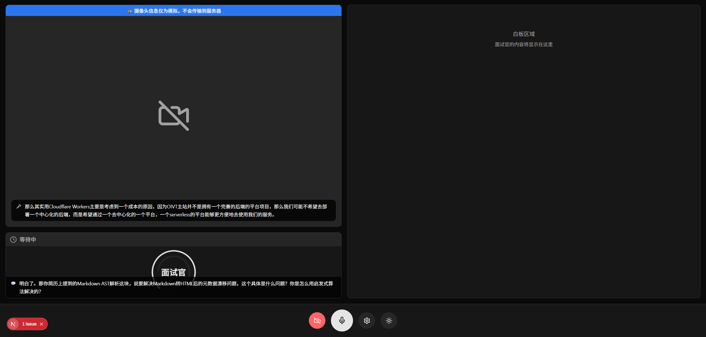

# Megrez



Megrez 是一个基于 AI SDK 的模拟面试平台，旨在帮助用户提升面试技能。通过与 Agent 面试官进行互动，用户可以获得实时反馈和建议，从而更好地准备实际面试。

**Megrez 仍在开发中，这意味着其中的某些功能可能仍不稳定或可能产生错误，**

## 调试

```bash
bun install && bun run dev
```

## 部署

在 `.env.local` 设置以下环境变量：

```env
ANTHROPIC_API_KEY=your_anthropic_api_key
OPENAI_API_KEY=your_openai_api_key
```

你可以在 `./context` 文件夹内放入 `Job-Description.md` 和 `Resume.pdf` 来定制面试内容，Megrez 在运行时会自动读取它们。

## 协议

Megrez is licensed under the [Apache-2.0 License](./LICENSE).